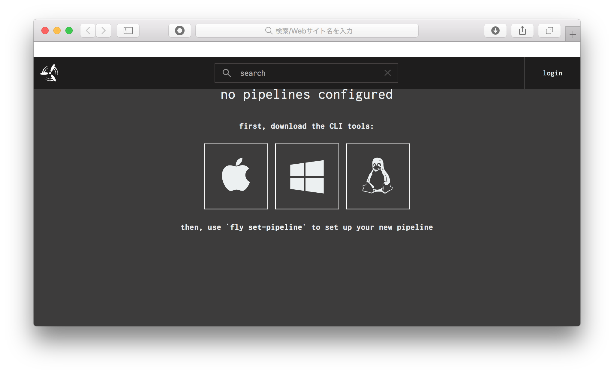
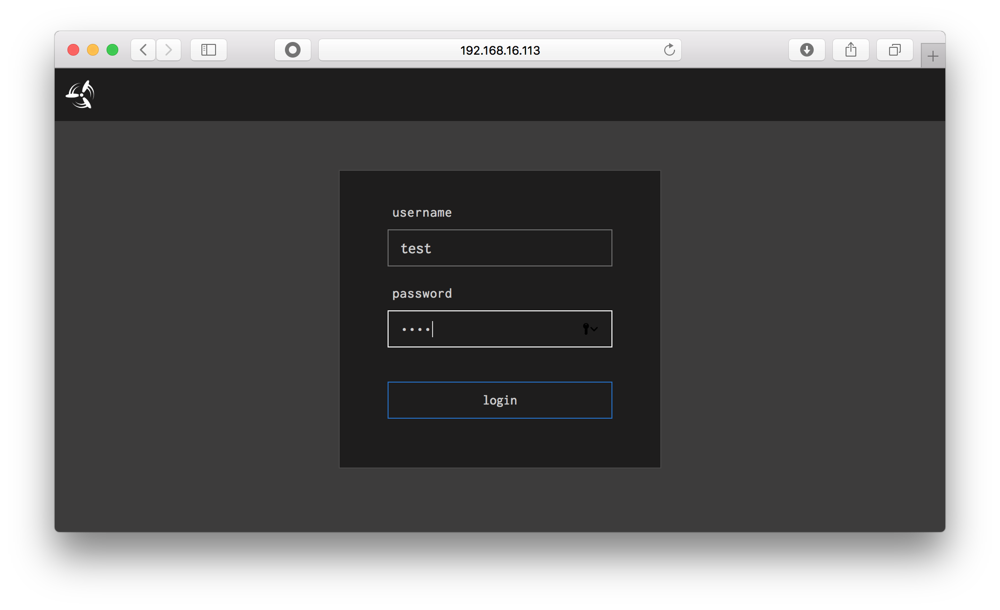
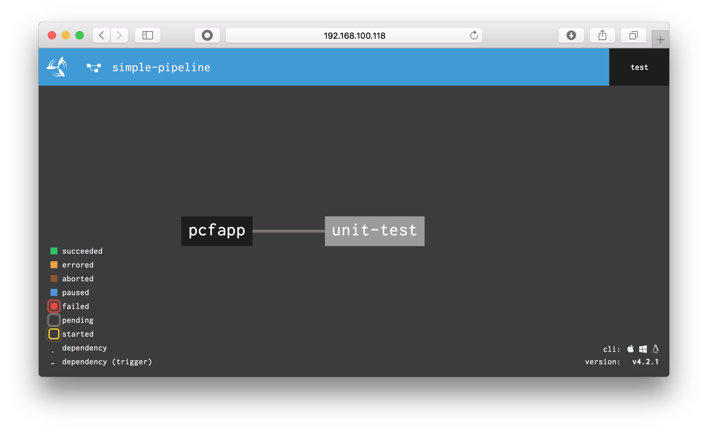
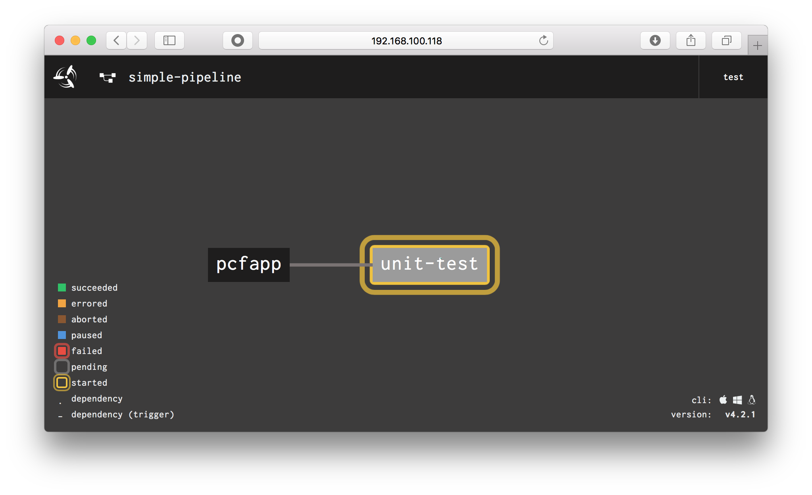
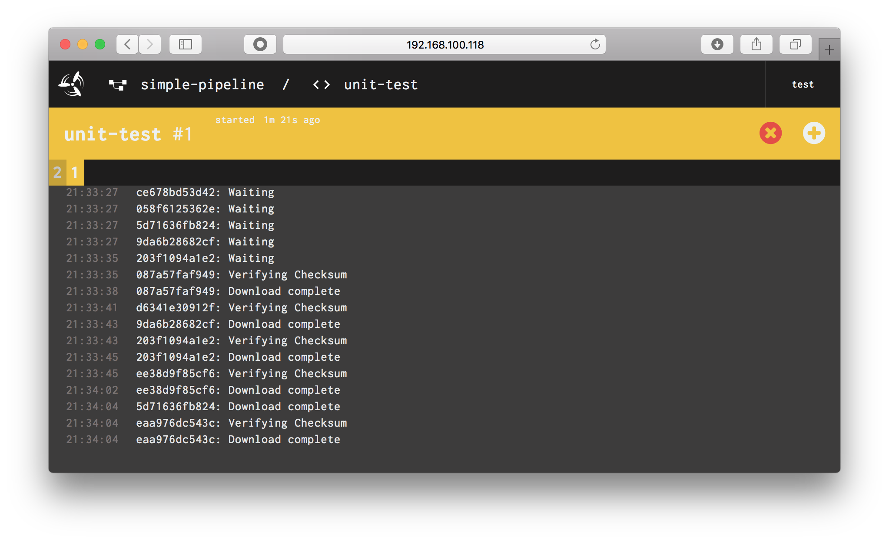
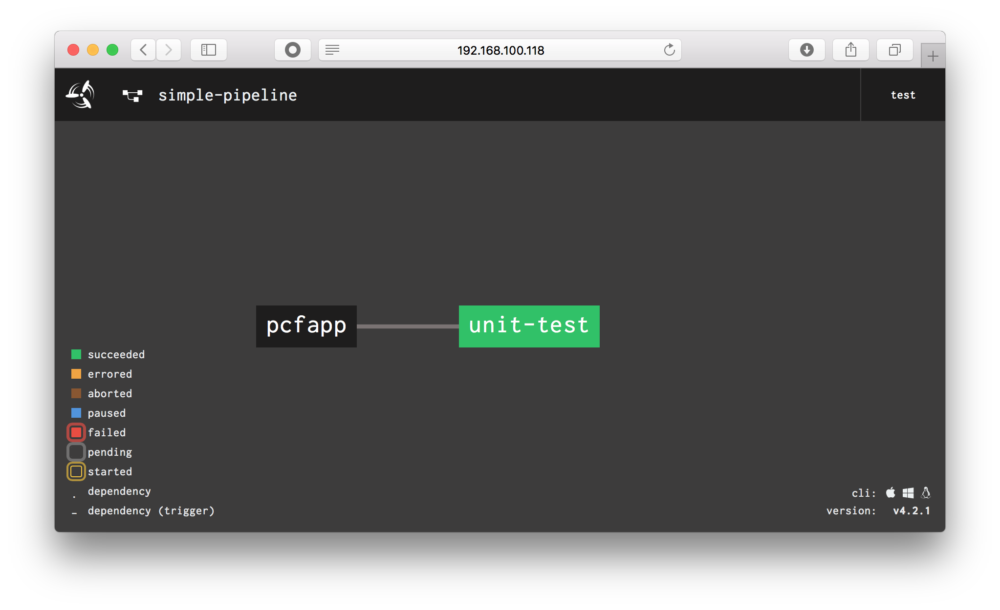
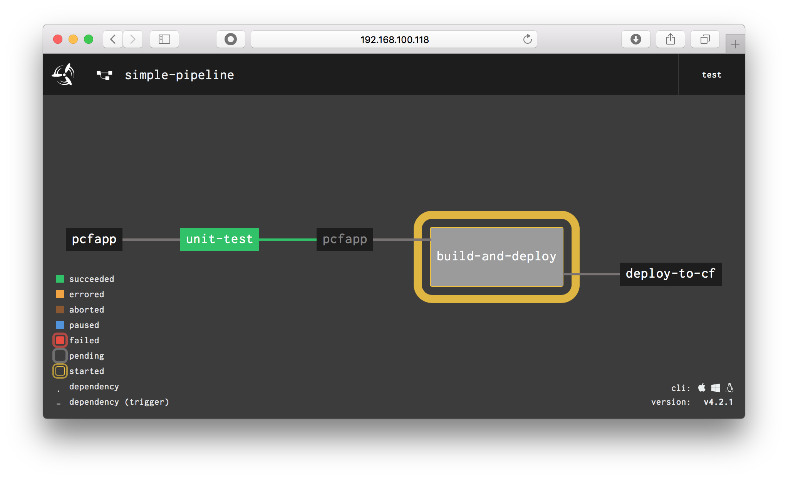
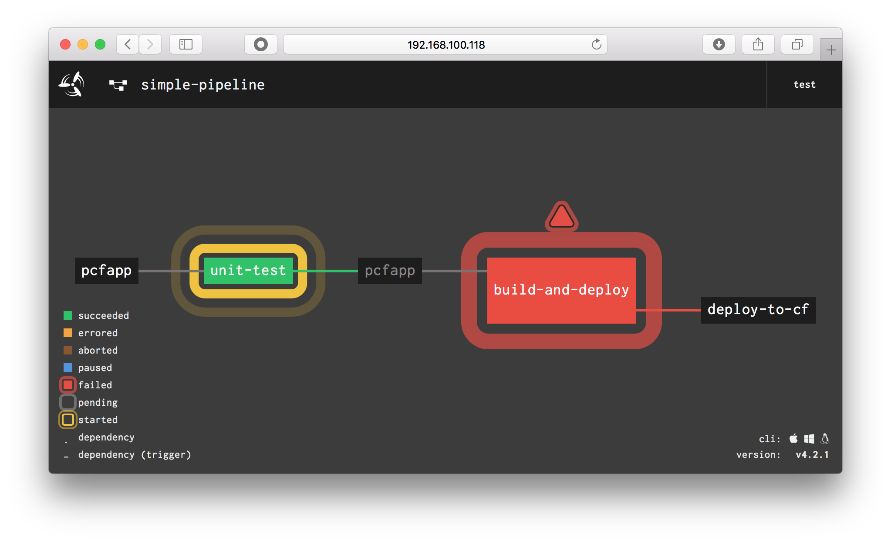
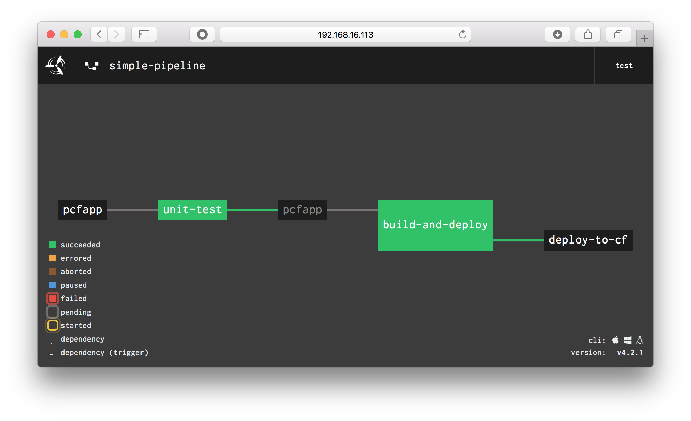

# Concourse による継続的デリバリ
Pivotal Cloud Foundry への継続的デリバリを **Concourse** を用いて行います。

## 概要 / 説明


## 前提 / 環境
- [事前作業](https://github.com/shinyay/pcf-workshop-prerequisite/blob/master/README.md)

## 手順 / 解説
### Concourse 環境の準備 (Docker)
Docker コンテナとして動作する Concourse を使用します。
事前に Docker をインストールします。

#### Docker のインストール
- MacOS

```
$ brew cask install docker
```

- Linux

```
yum install docker -y
```

#### Concourse コンテナの準備
Concourse コンテナを使用するための定義ファイル (**docker-compose.yml**) を提供している GihHub リポジトリをクローンして使用します。

```
$ git clone https://github.com/concourse/concourse-docker.git
```

Concourseのための鍵ファイルを作成します。
以下のスクリプトを実行します。

```
$ cd concourse-docker
$ ./generate-keys.sh
```

`CONCOURSE_EXTERNAL_URL` をローカルにアサインされたIPアドレスでアクセスするように設定します。

bash の場合
```
$ export CONCOURSE_EXTERNAL_URL=http://$(ipconfig getifaddr en0):8080
```

fish の場合
```
$ set -x CONCOURSE_EXTERNAL_URL http://(ipconfig getifaddr en0):8080
```

docker-compose.yml を編集し、環境変数の `CONCOURSE_EXTERNAL_URL` を使用するように編集します。

```
$ vi docker-compose.yml
```

以下のように修正します。

```
- CONCOURSE_EXTERNAL_URL=${CONCOURSE_EXTERNAL_URL}
```

#### Concourse コンテナの起動
以下のコマンドで Concourse コンテナを起動します。

```
$ docker-compose up -d
```

認証はデフォルトで設定されている test を使用します。

- User: test
- Pass: test

Concourse には、http://<CONCOURSE_EXTERNAL_URL>:8080 でアクセスできます。

### Concourse CLI (fly)のインストール
Concourse の CLI として **fly** が提供されています。
アクセスした Concourse の画面から、インストールイメージをダウンロードして導入できます。




また、cURL を使用してインストールイメージをダウンロードして導入する事もできます。

```
$ curl -LO https://github.com/concourse/concourse/releases/download/v4.2.1/fly_darwin_amd64
$ chmod +x fly_darwin_amd64
$ mv fly_darwin_amd64 /usr/local/bin/fly
```

```
$ fly --version

4.2.1
```

### アップグレード前のアプリケーションのデプロイ
#### アップグレード前のアプリケーションの準備
GitHub リポジトリ `https://github.com/shinyay/pcf-workshop-upgrade-code.git` をクローンして使用します。
このリポジトリの `before-upgrade` ブランチにアップグレード前のソースコードが入っているのでブランチを切り替えます。

```
$ git clone https://github.com/shinyay/pcf-workshop-upgrade-code.git
$ git checkout before-upgrade
```

アプリケーションをビルドしてデプロイを行います。

```
$ ./gradlew clean build -x test
$ cf push
```

#### アップグレード前のアプリケーションの確認
cURL コマンドでアプリケーションにアクセスし、動作確認を行います。
確認するには、以下のコマンドを使用します。

```
$ curl http://<アプリケーションURL> 
```

実行結果として以下が表示される事が確認できます。
`Pivotal` の i が抜けて `P votal` となっています。
これを `Pivotal` となるように後の手順で修正します。

```
MMMMMMMMMMMMMMMMMWMMMMMMMMMMMMMMMMMMMMMMMMMMMMMMMMMMMMMMMMMMMMMMMMMMMMMMMMMMMMMMMMMMMMMMMMMMMMMMMMMMMMMMMMMMMMMMMMMMMMMMMMMMMMMMMMFMMMMMMM
M]                 ?WMMMMMM#MMMMMMMMMMMMMMMMMMMMMMMMMMMMMMMMMMMMMMMMMMMMMMMMMMMMMMMMMMMMMMMMMMMMMMMMMMMMMMMMMMMMMMMMMMMMMMMMMMMMMMMF    .M
M]    ........       .HMMMM#MMMMMMMMMMMMMMMMMMMMMMMMMMMMMMMMMMMMMMMMMMMMMMMMMMMMMMMMMMMMMF!`  .MMMMMMMMMMMMMMMMMMMMMMMMMMMMMMMMMMMMF    .M
M]    .MMMMMMMMNa.     MMMMMMMMMMMMMMMMMMMMMMMMMMMMMMMMMMMMMMMMMMMMMMMMMMMMMMMMMMMMMMMMMM[    .MMMMMMMMMMMMMMMMMMMMMMMMMMMMMMMMMMMMF    .M
M]    .MMMMMMMMMMN     (MMMMHHHHHMMMMHHHHHHMMMMMMMMMMMMMMHHHHHMMMMMMMMMMMMHMMMMMMMMMMMMMM[    .HHHHHHHHMMMMMMMMMMYMMMMMMMHMMMMMMMMMF    .M
M]    .MMMMMMMMMMM{    .MMM#MMMMMMMMF      HMMMMMMMMMMMMF    .MMMMM#M`         .TMMMMMMMM[            .MMMMMM@M               ,MMMMF    .M
M]    .MMMMMMMMMMM`    .MMM#MMMMMMMMh..    .MMMMMMMMMMMM`   .MMMMB!      ...      ,HMMMMM[    .........MMMM@`     ........    .MMMMF    .M
M]    .MMMMMMMMMM^     JMMM#MMMMMMMMMMM]    4MMMMMMMMMM]    dMMMF    ..MMMMMMNJ     UMMMM[    .MMMMMMMMMMMF     .MMMMMMMMF    .MMMMF    .M
M]    .MMMMMMM=`      .MMMM#MMMMMMMMMMMM,    MMMMMMMMM#    .MMMF    .MMMMMMMMMMN.    MMMM[    .MMMMMMMMMMM`    MMMMMMMMMMF    .MMMMF    .M
M]    .MMM          .MMMMMM#MMMMMMMMMMMMN    (MMMMMMMM^   .MMMM%    dMMMMMMMMMMMb    (MMM[    .MMMMMMMMMM#    .MMMMMMMMMMF    .MMMMF    .M
M]    .MMM.  ....(MMMMMMMMM#MMMMMMMMMMMMM]    MMMMMMMF    JMMMM)    MMMMMMMMMMMM#    .MMM[    .MMMMMMMMMMF    (MMMMMMMMMMF    .MMMMF    .M
M]    .MMMMMMMMMMMMMMMMMMMM#MMMMMMMMMMMMMM,   .MMMMMM`   .MMMMM)    MMMMMMMMMMMM#    .MMM[    .MMMMMMMMMMF    (MMMMMMMMMMF    .MMMMF    .M
M]    .MMMMMMMMMMMMMMMMMMMM#MMMMMMMMMMMMMMb    dMMMMt   .MMMMMM)    MMMMMMMMMMMMF    -MMM[    .MMMMMMMMMM#    .MMMMMMMMMMF    .MMMMF    .M
M]    .MMMMMMMMMMMMMMMMMMMM#MMMMMMMMMMMMMMM[   .MMM#    (MMMMMMb    -MMMMMMMMMMM^    dMMM[    .MMMMMMMMMMM,    UMMMMMMMMMF    .MMMMF    .M
M]    .MMMMMMMMMMMMMMMMMMMM#MMMMMMMMMMMMMMMN.   (MM'   .MMMMMMMM,    -MMMMMMMM#'    .MMMM]    .MMMMMMMMMMMN.    ?HMMMMMMMF    .MMMMF    .M
M]    .MMMMMMMMMMMMMMMMMMMM#MMMMMMMMMMMMMMMMb    7^    MMMMMMMMMMx      ?MMM^      .MMMMMb       `````(MMMMN,         JMMF    .MMMMF    .M
M]    .MMMMMMMMMMMMMMMMMMMM#MMMMMMMMMMMMMMMMMb       .dMMMMMMMMMMMNJ.           ..MMMMMMMMN.          .MMMMMMN,.      JMMF    .MMMMF    .M
MNMMMMNMMMMMMMMMMMMMMMMMMMMNMMMMMMMMMMMMMMMMMMMMMMMMMMMMMMMMMMMMMMMMMMNMMMMMMMMMMMMMMMMMMMMMMMNMMMMMMMNMMMMMMMMMMMNNMMMMMNMMMMMMMMMNMMMMNM

Current app version = 1
Current java version = 25.192-b12
App index = 0
App host = 10.10.148.171
```

### Concourse パイプラインの作成
Concourse では、YAML ファイルによるパイプラインの定義を行います。

#### Concourse へのログイン
まず、`fly` コマンドで Concourse を操作出来るようにログインを行います。

```
$ fly -t hello-ci login -c <CONCOURSE_EXTERNAL_URL>

ogging in to team 'main'

navigate to the following URL in your browser:

  http://192.168.100.118:8080/sky/login?redirect_uri=http://127.0.0.1:62332/auth/callback

or enter token manually:
target saved
```

ログイン時に提示される URL にアクセスし、ログインします。

- User: test
- Pass: test



#### パイプラインの作成
単体テストを実行するパイプラインの定義を作成します。
`pipeline.yml` という名前でファイルを作成し、以下の内容を記述します。

```yaml

---
resources:
- name: pcfapp
  type: git
  source:
    uri: https://github.com/shinyay/pcf-workshop-upgrade-code.git
    branch: master
  check_every: 10s
jobs:
- name: unit-test
  plan:
  - get: pcfapp
    trigger: true
  - task: gradle-test
    config:
      platform: linux
      image_resource:
        type: docker-image
        source:
          {repository: java, tag: openjdk-8}
      inputs:
      - name: pcfapp
      run:
        path: bash
        args:
        - -c
        - |
          cd pcfapp
          ./gradlew tasks
```

#### パイプラインの登録
次に、単体テスト用のパイプラインを Concourse に登録します。

```
$ fly -t hello-ci set-pipeline -p simple-pipeline -c pipeline.yml
```

<details><summary>実行結果</summary>

```
resources:
  resource pcfapp has been added:
+ name: pcfapp
+ type: git
+ source:
+   branch: master
+   uri: https://github.com/shinyay/pcf-workshop-upgrade-code
+ check_every: 10s

jobs:
  job unit-test has been added:
+ name: unit-test
+ plan:
+ - get: pcfapp
+   trigger: true
+ - task: gradle-test
+   config:
+     platform: linux
+     image_resource:
+       type: docker-image
+       source:
+         repository: gradle
+     run:
+       path: bash
+       args:
+       - -c
+       - |-
+         set -e
+         cd pcfapp
+         gradle test
+     inputs:
+     - name: pcfapp

apply configuration? [yN]: y
pipeline created!
you can view your pipeline here: http://192.168.100.118:8080/teams/main/pipelines/simple-pipeline

the pipeline is currently paused. to unpause, either:
  - run the unpause-pipeline command
  - click play next to the pipeline in the web ui
```
</details>

#### パイプラインの確認
ブラウザから Concourse にアクセスして登録したパイプラインを確認します。

- http://<CONCOURSE_EXTERNAL_URL>/teams/main/pipelines/simple-pipeline



### Concourse パイプラインの開始
パイプラインの登録時点では、パイプラインは一時停止状態になっています。
そこで、以下のコマンドを使用して開始します。

- 一時停止状態の解除

```
$ fly -t hello-ci unpause-pipeline -p simple-pipeline

unpaused 'simple-pipeline'
```

- 単体テストジョブの開始

```
$ fly -t hello-ci trigger-job -j simple-pipeline/unit-test

started simple-pipeline/unit-test #1
```

#### Concourse パイプラインの実行中の状態

ジョブが動き始めると、黄色い枠が点滅します。



ジョブをクリックすると実行中のログを確認できます。



ジョブが終了すると、正常に緑色に変化します。



### ビルド＆デプロイ用パイプラインの追加
次にジョブの連携を行います。
ここでは、先に定義した **単体テスト** ジョブに、**ビルド＆デプロイ** ジョブを連携したパイプラインを定義します。
 
#### パイプラインの作成
ビルド＆デプロイ用の処理が追加されたパイプラインを作成します。
`pipeline-build-and-deploy.yml` を作成し、
以下の YAML の記述で `<YOUR_USERID>` `<YOUR_PASSWD>` `<YOUR_ORG>` をそれぞれ自分の情報に書き換えます。

- pipeline-build-and-deploy.yml

```yaml

---
resources:
- name: pcfapp
  type: git
  source:
    uri: https://github.com/shinyay/pcf-workshop-upgrade-code.git
    branch: master
  check_every: 10s
- name: deploy-to-cf
  type: cf
  source:
    api: api.run.pivotal.io
    username: <YOUR_USERID>
    password: <YOUR_PASSWD>
    organization: <YOUR_ORG>
    space: development
    skip_cert_check: true
jobs:
- name: unit-test
  plan:
  - get: pcfapp
    trigger: true
  - task: gradle-test
    config:
      platform: linux
      image_resource:
        type: docker-image
        source:
          {repository: java, tag: openjdk-8}
      inputs:
      - name: pcfapp
      run:
        path: bash
        args:
        - -c
        - |
          cd pcfapp
          ./gradlew test
- name: build-and-deploy
  plan:
  - get: pcfapp
    passed: [ unit-test ]
    trigger: true
  - task: build
    config:
      platform: linux
      image_resource:
        type: docker-image
        source:
          {repository: java, tag: openjdk-8}
      inputs:
      - name: pcfapp
      outputs:
      - name: out
      run:
        path: bash
        args:
        - -c
        - |
          cd pcfapp
          ./gradlew clean build -x test
          mv build/libs/hello-pcf-upgrade-0.0.1-SNAPSHOT.jar ../out
  - put: deploy-to-cf
    params:
      manifest: pcfapp/manifest.yml
      current_app_name: hello-pcf-upgrade
      path: out/hello-pcf-upgrade-0.0.1-SNAPSHOT.jar
```

#### パイプラインの更新
`pipeline-build-and-deploy.yml` を Concourse に反映します。

反映するには、以下のコマンドを使用します。

```
$ fly -t hello-ci set-pipeline -p simple-pipeline -c pipeline-build-and-deploy.yml
```
#### パイプラインの確認
ブラウザから Concourse にアクセスして登録したパイプラインを確認します。

- http://<CONCOURSE_EXTERNAL_URL>/teams/main/pipelines/simple-pipeline



ビルド＆デプロイ用のジョブが追加されている事が確認できます。

### 継続的デリバリの実施
先にデプロイしているアプリケーションが出力するアスキーアートは、`P votal` でした。
これを、`Pivotal` に修正し、自動で Pivotal Cloud Foundry へデプロイします。

#### アプリケーションの更新

- HelloPcfUpgradeApplication.java のアスキーアートの修正
  - 以下のアスキーアートに置き換えます。

```
        return "MMMMMMMMMMMMMMMMMWMMMMMMMMMMMMMMMMMMMMMMMMMMMMMMMMMMMMMMMMMMMMMMMMMMMMMMMMMMMMMMMMMMMMMMMMMMMMMMMMMMMMMMMMMMMMMMMMMMMMMMMMMMMMMMMMFMMMMMMM\n"+
                "M]                 ?WMMMMMM#     MMMMMMMMMMMMMMMMMMMMMMMMMMMMMMMMMMMMMMMMMMMMMMMMMMMMMMMMMMMMMMMMMMMMMMMMMMMMMMMMMMMMMMMMMMMMMMMMMMF    .M\n"+
                "M]    ........       .HMMMM#     MMMMMMMMMMMMMMMMMMMMMMMMMMMMMMMMMMMMMMMMMMMMMMMMMMMMMMMMF!`  .MMMMMMMMMMMMMMMMMMMMMMMMMMMMMMMMMMMMF    .M\n"+
                "M]    .MMMMMMMMNa.     MMMMMMMMMMMMMMMMMMMMMMMMMMMMMMMMMMMMMMMMMMMMMMMMMMMMMMMMMMMMMMMMMM[    .MMMMMMMMMMMMMMMMMMMMMMMMMMMMMMMMMMMMF    .M\n"+
                "M]    .MMMMMMMMMMN     (MMMMHHHHHMMMMHHHHHHMMMMMMMMMMMMMMHHHHHMMMMMMMMMMMMHMMMMMMMMMMMMMM[    .HHHHHHHHMMMMMMMMMMYMMMMMMMHMMMMMMMMMF    .M\n"+
                "M]    .MMMMMMMMMMM{    .MMM#     MMMF      HMMMMMMMMMMMMF    .MMMMM#M`         .TMMMMMMMM[            .MMMMMM@M               ,MMMMF    .M\n"+
                "M]    .MMMMMMMMMMM`    .MMM#     MMMh..    .MMMMMMMMMMMM`   .MMMMB!      ...      ,HMMMMM[    .........MMMM@`     ........    .MMMMF    .M\n"+
                "M]    .MMMMMMMMMM^     JMMM#     MMMMMM]    4MMMMMMMMMM]    dMMMF    ..MMMMMMNJ     UMMMM[    .MMMMMMMMMMMF     .MMMMMMMMF    .MMMMF    .M\n"+
                "M]    .MMMMMMM=`      .MMMM#     MMMMMMM,    MMMMMMMMM#    .MMMF    .MMMMMMMMMMN.    MMMM[    .MMMMMMMMMMM`    MMMMMMMMMMF    .MMMMF    .M\n"+
                "M]    .MMM          .MMMMMM#     MMMMMMMN    (MMMMMMMM^   .MMMM%    dMMMMMMMMMMMb    (MMM[    .MMMMMMMMMM#    .MMMMMMMMMMF    .MMMMF    .M\n"+
                "M]    .MMM.  ....(MMMMMMMMM#     MMMMMMMM]    MMMMMMMF    JMMMM)    MMMMMMMMMMMM#    .MMM[    .MMMMMMMMMMF    (MMMMMMMMMMF    .MMMMF    .M\n"+
                "M]    .MMMMMMMMMMMMMMMMMMMM#     MMMMMMMMM,   .MMMMMM`   .MMMMM)    MMMMMMMMMMMM#    .MMM[    .MMMMMMMMMMF    (MMMMMMMMMMF    .MMMMF    .M\n"+
                "M]    .MMMMMMMMMMMMMMMMMMMM#     MMMMMMMMMb    dMMMMt   .MMMMMM)    MMMMMMMMMMMMF    -MMM[    .MMMMMMMMMM#    .MMMMMMMMMMF    .MMMMF    .M\n"+
                "M]    .MMMMMMMMMMMMMMMMMMMM#     MMMMMMMMMM[   .MMM#    (MMMMMMb    -MMMMMMMMMMM^    dMMM[    .MMMMMMMMMMM,    UMMMMMMMMMF    .MMMMF    .M\n"+
                "M]    .MMMMMMMMMMMMMMMMMMMM#     MMMMMMMMMMN.   (MM'   .MMMMMMMM,    -MMMMMMMM#'    .MMMM]    .MMMMMMMMMMMN.    ?HMMMMMMMF    .MMMMF    .M\n"+
                "M]    .MMMMMMMMMMMMMMMMMMMM#     MMMMMMMMMMMb    7^    MMMMMMMMMMx      ?MMM^      .MMMMMb       `````(MMMMN,         JMMF    .MMMMF    .M\n"+
                "M]    .MMMMMMMMMMMMMMMMMMMM#     MMMMMMMMMMMMb       .dMMMMMMMMMMMNJ.           ..MMMMMMMMN.          .MMMMMMN,.      JMMF    .MMMMF    .M\n"+
                "MNMMMMNMMMMMMMMMMMMMMMMMMMMNMMMMMMMMMMMMMMMMMMMMMMMMMMMMMMMMMMMMMMMMMMNMMMMMMMMMMMMMMMMMMMMMMMNMMMMMMMNMMMMMMMMMMMNNMMMMMNMMMMMMMMMNMMMMNM\n"
                +"\r\n"
```

#### パイプラインの開始
修正したアプリケーションを GitHub へコミット＆プッシュします。
GitHub の更新をトリガーに、パイプラインが開始します。

```
$ git add .
$ git commit -m 'Modify ascii art'
$ git push origin master
```

#### Concourse パイプラインの実行中の状態
ブラウザから Concourse にアクセスして開始したパイプラインを確認します。

- http://<CONCOURSE_EXTERNAL_URL>/teams/main/pipelines/simple-pipeline

最初に 単体テストジョブ `unit-test` が動作している事が確認できます。



しばらくすると、ビルド＆デプロイ用ジョブ `build-and-deploy` に遷移します。
そして、全てのジョブが終了すると全て緑色で表示されて正常終了の状態になる事が確認できます。



### アップグレード後のアプリケーションの確認
cURL コマンドでアプリケーションにアクセスし、動作確認を行います。

```
$ curl <アプリケーションURL> 

MMMMMMMMMMMMMMMMMWMMMMMMMMMMMMMMMMMMMMMMMMMMMMMMMMMMMMMMMMMMMMMMMMMMMMMMMMMMMMMMMMMMMMMMMMMMMMMMMMMMMMMMMMMMMMMMMMMMMMMMMMMMMMMMMMFMMMMMMM
M]                 ?WMMMMMM#     MMMMMMMMMMMMMMMMMMMMMMMMMMMMMMMMMMMMMMMMMMMMMMMMMMMMMMMMMMMMMMMMMMMMMMMMMMMMMMMMMMMMMMMMMMMMMMMMMMF    .M
M]    ........       .HMMMM#     MMMMMMMMMMMMMMMMMMMMMMMMMMMMMMMMMMMMMMMMMMMMMMMMMMMMMMMMF!`  .MMMMMMMMMMMMMMMMMMMMMMMMMMMMMMMMMMMMF    .M
M]    .MMMMMMMMNa.     MMMMMMMMMMMMMMMMMMMMMMMMMMMMMMMMMMMMMMMMMMMMMMMMMMMMMMMMMMMMMMMMMM[    .MMMMMMMMMMMMMMMMMMMMMMMMMMMMMMMMMMMMF    .M
M]    .MMMMMMMMMMN     (MMMMHHHHHMMMMHHHHHHMMMMMMMMMMMMMMHHHHHMMMMMMMMMMMMHMMMMMMMMMMMMMM[    .HHHHHHHHMMMMMMMMMMYMMMMMMMHMMMMMMMMMF    .M
M]    .MMMMMMMMMMM{    .MMM#     MMMF      HMMMMMMMMMMMMF    .MMMMM#M`         .TMMMMMMMM[            .MMMMMM@M               ,MMMMF    .M
M]    .MMMMMMMMMMM`    .MMM#     MMMh..    .MMMMMMMMMMMM`   .MMMMB!      ...      ,HMMMMM[    .........MMMM@`     ........    .MMMMF    .M
M]    .MMMMMMMMMM^     JMMM#     MMMMMM]    4MMMMMMMMMM]    dMMMF    ..MMMMMMNJ     UMMMM[    .MMMMMMMMMMMF     .MMMMMMMMF    .MMMMF    .M
M]    .MMMMMMM=`      .MMMM#     MMMMMMM,    MMMMMMMMM#    .MMMF    .MMMMMMMMMMN.    MMMM[    .MMMMMMMMMMM`    MMMMMMMMMMF    .MMMMF    .M
M]    .MMM          .MMMMMM#     MMMMMMMN    (MMMMMMMM^   .MMMM%    dMMMMMMMMMMMb    (MMM[    .MMMMMMMMMM#    .MMMMMMMMMMF    .MMMMF    .M
M]    .MMM.  ....(MMMMMMMMM#     MMMMMMMM]    MMMMMMMF    JMMMM)    MMMMMMMMMMMM#    .MMM[    .MMMMMMMMMMF    (MMMMMMMMMMF    .MMMMF    .M
M]    .MMMMMMMMMMMMMMMMMMMM#     MMMMMMMMM,   .MMMMMM`   .MMMMM)    MMMMMMMMMMMM#    .MMM[    .MMMMMMMMMMF    (MMMMMMMMMMF    .MMMMF    .M
M]    .MMMMMMMMMMMMMMMMMMMM#     MMMMMMMMMb    dMMMMt   .MMMMMM)    MMMMMMMMMMMMF    -MMM[    .MMMMMMMMMM#    .MMMMMMMMMMF    .MMMMF    .M
M]    .MMMMMMMMMMMMMMMMMMMM#     MMMMMMMMMM[   .MMM#    (MMMMMMb    -MMMMMMMMMMM^    dMMM[    .MMMMMMMMMMM,    UMMMMMMMMMF    .MMMMF    .M
M]    .MMMMMMMMMMMMMMMMMMMM#     MMMMMMMMMMN.   (MM'   .MMMMMMMM,    -MMMMMMMM#'    .MMMM]    .MMMMMMMMMMMN.    ?HMMMMMMMF    .MMMMF    .M
M]    .MMMMMMMMMMMMMMMMMMMM#     MMMMMMMMMMMb    7^    MMMMMMMMMMx      ?MMM^      .MMMMMb       `````(MMMMN,         JMMF    .MMMMF    .M
M]    .MMMMMMMMMMMMMMMMMMMM#     MMMMMMMMMMMMb       .dMMMMMMMMMMMNJ.           ..MMMMMMMMN.          .MMMMMMN,.      JMMF    .MMMMF    .M
MNMMMMNMMMMMMMMMMMMMMMMMMMMNMMMMMMMMMMMMMMMMMMMMMMMMMMMMMMMMMMMMMMMMMMNMMMMMMMMMMMMMMMMMMMMMMMNMMMMMMMNMMMMMMMMMMMNNMMMMMNMMMMMMMMMNMMMMNM

Current app version = 1
Current java version = 25.192-b12
App index = 0
App host = 10.10.148.247⏎
```

アプリケーションがアップグレードできている事が確認できます。

## まとめ / 振り返り

## 参考
- [PCF Pipelines](https://github.com/pivotal-cf/pcf-pipelines)
- [Concourse Samples and Recipes](https://github.com/pivotalservices/concourse-pipeline-samples)
